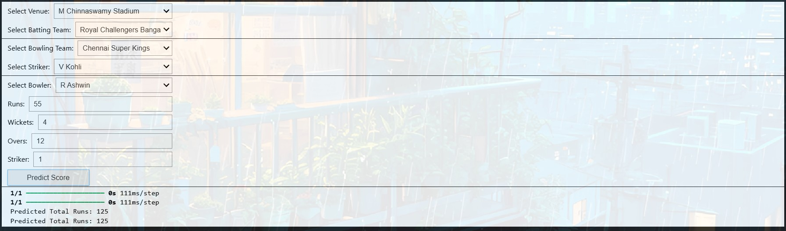

---

# 🏏 IPL Score Prediction Using Deep Learning

## 📌 Project Overview

In the fast-paced world of the Indian Premier League (IPL), predicting the final score of a cricket match can be both exciting and challenging. This mini project focuses on **predicting the final score of an IPL innings using Deep Learning techniques** based on match conditions such as venue, batting team, bowling team, overs, runs, and wickets.

The model is trained on historical IPL match data and provides an **interactive score prediction interface** using widgets.

---

## 🎯 Objective

* To build a **Deep Learning regression model** that predicts the final IPL score
* To preprocess real-world cricket data effectively
* To evaluate model performance using regression metrics
* To provide an **interactive score prediction system** for users

---

## 📂 Dataset Information

* **Source:** IPL match dataset (2008–2017)
* **File Used:** `ipl_data.csv`
* **Target Variable:** Final Score

### Key Features Used:

* Batting Team
* Bowling Team
* Venue
* Runs scored
* Wickets fallen
* Overs completed

Categorical features are encoded and numerical features are scaled before training.

---

## 🛠️ Technologies & Libraries Used

* **Python**
* **Pandas & NumPy** – Data handling
* **Matplotlib & Seaborn** – Data visualization
* **Scikit-learn** – Preprocessing & evaluation
* **TensorFlow & Keras** – Deep Learning model
* **ipywidgets** – Interactive prediction interface

---

## 🔍 Project Workflow

1. **Library Installation & Import**
2. **Dataset Loading**
3. **Exploratory Data Analysis (EDA)**
4. **Data Cleaning & Feature Selection**
5. **Categorical Encoding**
6. **Feature Scaling**
7. **Train-Test Split**
8. **Deep Learning Model Creation**
9. **Model Training**
10. **Model Evaluation**
11. **Interactive Score Prediction Widget**

---

## 🧠 Model Architecture

* Input Layer
* Multiple Dense (Fully Connected) Hidden Layers
* ReLU Activation Functions
* Output Layer for Regression Prediction
* Optimizer: Adam
* Loss Function: Mean Squared Error (MSE)

---

## 📊 Model Evaluation

The model performance is evaluated using:

* **Mean Absolute Error (MAE)**
* **Mean Squared Error (MSE)**

These metrics help assess how close the predicted score is to the actual score.

---

## 🖥️ Interactive Score Prediction

An interactive prediction system is built using **ipywidgets**, allowing users to:

* Select Batting Team
* Select Bowling Team
* Choose Venue
* Enter Runs, Wickets, and Overs

The model then predicts the **final IPL score in real time**.

### Sample Output:



> Example:
> Match between **RCB vs CSK** at **M. Chinnaswamy Stadium**
> **Predicted Score:** 125

---

## ⚠️ Important Notes

* GitHub **does not render interactive widgets** (`ipywidgets`).
* To use the interactive score prediction:

  * Download the notebook
  * Run it locally in **Jupyter Notebook or JupyterLab**

---

## 🚀 How to Run the Project

1. Clone the repository
2. Install required dependencies

   ```bash
   pip install pandas numpy matplotlib seaborn scikit-learn tensorflow keras ipywidgets
   ```
3. Open the notebook:

   ```bash
   jupyter notebook IPL_Score_Prediction.ipynb
   ```
4. Run all cells to train the model and use the interactive predictor

---

## 📌 Conclusion

This project demonstrates how **Deep Learning can be applied to sports analytics**, specifically IPL score prediction. By combining proper preprocessing, neural networks, and interactive tools, the model provides meaningful insights into match outcomes.

---
