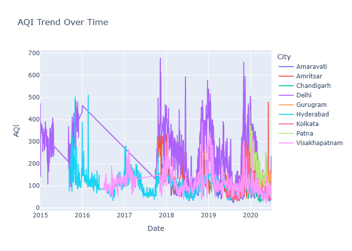
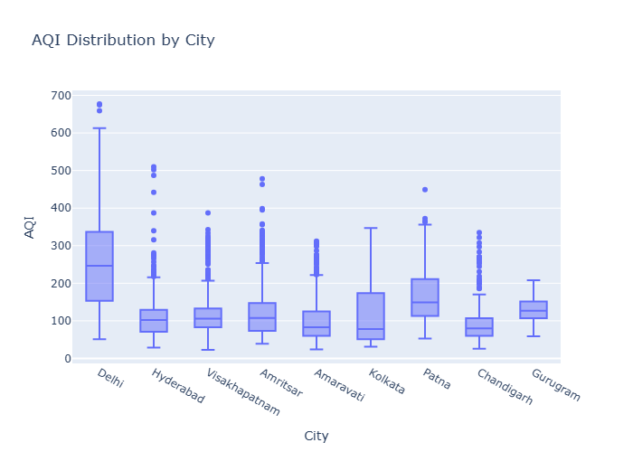
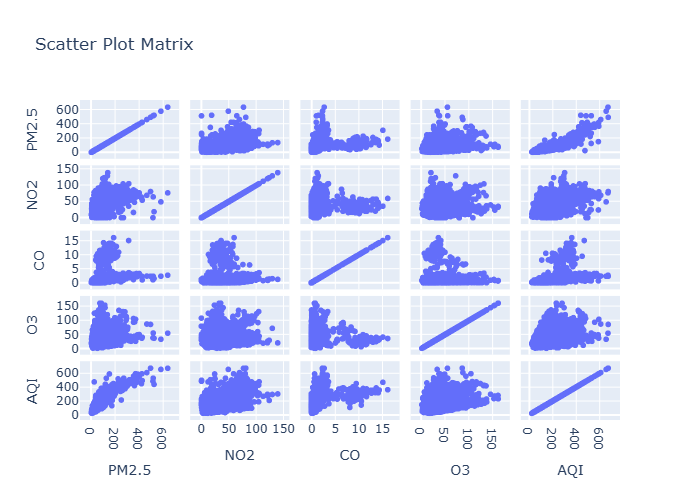

---

# 🌫️ Predicting Air Quality Using Neural Networks

## 📌 Project Overview

Air pollution is one of the most critical environmental and public health challenges today. This project focuses on **analyzing and predicting Air Quality Index (AQI)** values for multiple Indian cities using **data analysis, visualization, and a Neural Network model**.

The notebook performs:

* Exploratory Data Analysis (EDA)
* Visualization of AQI trends and distributions
* Feature preprocessing
* AQI prediction using an Artificial Neural Network (ANN)

The goal is to understand air quality patterns and build a predictive model that can estimate AQI based on historical data.

---

## 📊 Dataset Description

The dataset contains historical air quality data with the following key features:

* **Date** – Observation date
* **City** – Name of the city
* **AQI** – Air Quality Index value
* **Air Pollutants** – PM2.5, PM10, NO₂, SO₂, CO, O₃ (where available)

Multiple Indian cities are included to enable comparative analysis and trend visualization.

---

## 🛠️ Technologies & Libraries Used

* **Python**
* **NumPy & Pandas** – Data manipulation and preprocessing
* **Matplotlib & Seaborn** – Static visualizations
* **Plotly** – Interactive visualizations
* **Scikit-learn** – Scaling, train-test split
* **TensorFlow / Keras** – Neural Network model

---

## 🔍 Exploratory Data Analysis (EDA)

The following analyses are performed:

### 1️⃣ AQI Trend Over Time

* Visualizes how AQI values change over years
* City-wise AQI trend comparison

📌 *Static version shown below (PNG)*



---

### 2️⃣ AQI Distribution by City

* Box plots used to analyze AQI spread and variability
* Helps identify cities with consistently higher pollution levels

📌 *Static version shown below (PNG)*



---

### 3️⃣ Scatter Plot Matrix for selected features


* AQI effect on different features of the pollution elements
* Identification of different elements effect on each other

📌 *Static version shown below (PNG)*



---

## 🧠 Model Building – Neural Network

### 🔹 Data Preprocessing

* Handling missing values
* Feature selection
* Feature scaling using standardization
* Splitting data into training and testing sets

### 🔹 Model Architecture

* Fully connected Artificial Neural Network (ANN)
* Input layer based on selected features
* Hidden layers with activation functions
* Output layer for AQI prediction

### 🔹 Model Training

* Optimizer: Adam
* Loss function: Mean Squared Error (MSE)
* Performance evaluated on test data

---

## 📈 Model Performance

* The trained neural network successfully learns AQI patterns
* Predictions closely follow actual AQI trends
* Demonstrates the effectiveness of ANN for air quality prediction tasks

---

## ⚠️ Important Note About Plotly Graphs (GitHub Limitation)

This project uses **Plotly** for interactive visualizations.

🔴 **GitHub does NOT render interactive Plotly graphs inside Jupyter notebooks.**
As a result:

* Plotly graphs **will NOT appear dynamically on GitHub**
* The notebook code is correct, but GitHub has rendering limitations

### ✅ Solutions Implemented

* Key visualizations are **exported as PNG images**
* PNG images are displayed in this README for easy viewing

### 🔄 To View Interactive Graphs:

1. Clone/download the repository
2. Open the notebook (`.ipynb`) locally
3. Run the notebook in **VS Code / Jupyter Notebook**
4. Interactive Plotly graphs will render correctly

---

## 📂 Project Structure

```
├── Predicting_Air_Quality.ipynb
├── city_day.csv
├── aqi_trend.png
├── scatter_matrix.png
├── aqi_distribution.png
├── README.md
```

---

## 🚀 How to Run the Project Locally

```bash
# Clone the repository
git clone <repo-link>

# Install dependencies
pip install -r requirements.txt

# Run the notebook
jupyter notebook
```

---

## 🎯 Key Learnings

* Real-world AQI data analysis
* Visualization of multi-city air pollution trends
* Neural Network modeling for regression tasks
* Handling GitHub visualization limitations professionally

---

## 📌 Conclusion

This mini project demonstrates how **machine learning and deep learning techniques** can be applied to environmental data to gain insights and make predictions. It combines **data analysis, visualization, and neural networks** into a complete end-to-end workflow.

---
